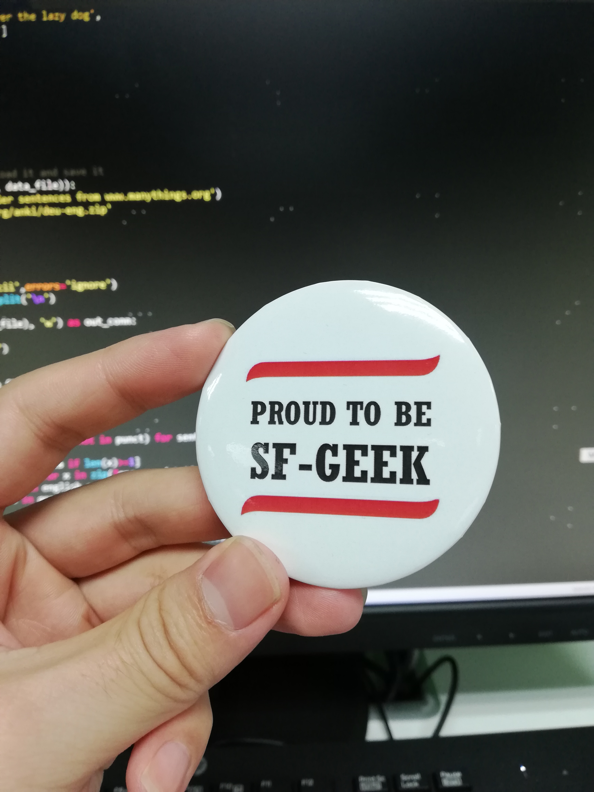

之前在逛贴吧时，看到有人发帖问该怎么学习Python语言，就随手点进去看看，贴下回复各抒己见，但我对其中一个印象深刻，他的回帖是两行代码：

```python
import everything as dog
dog.do()
```
当时看完这个回复就笑了，觉得非常幽默又形象地概括了Python语言的特点。需要做什么，把对应的包import进来，交给它来做就完事了。
<!--more-->

昨天听了部门朱工的分享，主题是 当我们开发的时候我们在开发什么(Code for who what how)，结合实例分析了代码开发中的遇到的问题和相关经验，分别提到了要 重视代码的可读性（注释、命名等） 经常重构代码等，关于代码可读性以前有所了解，但是代码重构还是第一次听说，于是百度了一下，感觉自己以前是真的无知啊，以为熟悉了Python的几个常用的包就登堂入室了，实际上自己连门都没摸到。

以后真的要做到事前思考（设计）过程动手（不眼高手低、不Ctrl +C/V） 结果测试（单元测试、重构） 事后总结, 拒绝做一个只会import的“调包侠”！

附1024当天公司举办程序员节活动获得的徽章一枚！
<!--more-->
