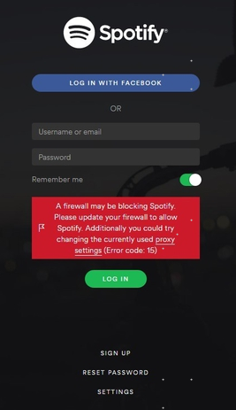

最近几周每周三都去健身房上一个老师的腰腹核心训练课，课程40分钟左右，强度很大，每次练完感觉非常酸爽。课堂一直有音乐伴奏，其中有一首英文歌感觉好听，但是不知道名字，只能听懂其中几句: imperfect person is my real ...。回来一百度，歌名叫[Love me anyway](https://www.baidu.com/link?url=P54T9vuf9nte9C6N2NJ-skBZ5upNvmrJeYBd0iINZrZpYBIxXmOjGwowCrewo_eqDy5PD7rDB-Su0xZIV2UWva&wd=&eqid=e726ed210000d4be000000065bdc3552)(链接是网易云音乐，奇怪的是spotify上竟然没有)歌手Ginny Blackmore，上网百度其人，发现资料甚少，只有[wiki百科](https://en.wikipedia.org/wiki/Ginny_Blackmore)不到一页的介绍，个人[官方网站](https://ginnyblackmore.com/)。
<!--more-->

放一张歌手的靓照
,一种特殊的魅力有木有！

在找歌手的资料的时候，解决了spotify无法登陆的问题，惊喜！生活中任何时候都不能少了音乐的相伴，在安装了Ubuntu系统之后，苦于没有好的音乐软件，好容易装了spotify，又死活登陆不上，如下图

上网百度各种解决方案，最终开着VPN，同时修改Spotify代理(Proxy)地址为127.0.0.1，端口为1080，登陆，然后熟悉的界面回来了。

分析应该是当时注册的时候用的gmail，而且当时也开着VPN，然后Ip地址在新加坡，在关了VPN再登陆时，软件检测到与注册时IP不对应，就无法登陆，于是自然地解决方案就是开着VPN登陆，同时将软件代理设置为默认网关。
