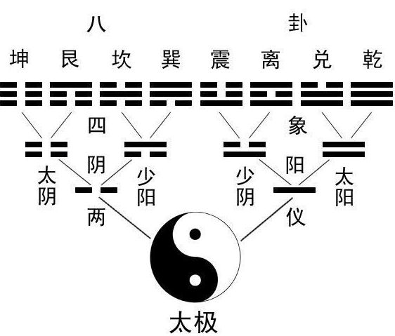

由一道经典的面试题引入：有一千瓶液体，其中一瓶有毒，其余无毒，现要利用小白鼠进行试毒，找出具体是哪一瓶液体有毒，已知小白鼠喝下有毒的液体一星期后会毒发身亡，问最少需要几只小白鼠可以在最短的时间内找出那瓶有毒的液体？
<!--more-->
分析一下题目要求，首先，要在最短的时间内，找出有毒的液体；那么最快需要多长时间呢？显然是一个星期。那么，最少需要几只小白鼠呢，1000只？999只？500只？No！在了解完二进制后,我们会极大地减少这个数字。

什么是二进制？简单的说就是逢二进一。可能一开始会有点懵，先来看下**十进制**，构成数的元素有0到9共十个数字：
$$\begin{equation}
 \begin{split}
 1(D) = 1 \times 10^{0} \\
 23(D) = 2 \times 10^{1} + 3 \times 10^{0} \\
 456(D) = 4 \times 10^{2} + 5 \times 10^{1} + 6 \times 10^{0} \\
 7890(D) = 7 \times 10^{3} + 8 \times 10 ^{2} + 9 \times 10^{1} + 0 \times 10^{0} \\
 12345(D) = 1 \times 10^{4} + 2 \times 10 ^{3} + 3 \times 10^{2} + 4 \times 10^{1} + 5 \times 10^{0} \\
 \cdots
 \end{split}
\end{equation}$$
这是我们熟悉的计数方式。

对于**二进制**，构成数的元素只有0和1，
$$\begin{equation}
 \begin{split}
 1(B) = 1 \times 2^{0} = 1(D) \\
 10(B) = 1 \times 2^{1} + 0 \times 2^{0} = 2(D) \\
 101(B) = 1 \times 2^{2} + 0 \times 2^{1} + 1 \times 2^{0} = 5(D) \\
 1010(B) = 1 \times 2^{3} + 0 \times 2 ^{2} + 1 \times 2^{1} + 0 \times 2^{0} = 10(D) \\
 10101(B) = 1 \times 2^{4} + 0 \times 2^{3} + 1 \times 2^{2} + 0 \times 2^{1} + 1 \times 2^{0} = 21(D) \\
 \cdots
 \end{split}
\end{equation}$$

那么十进制如何转化为二进制？不断地与2做除法取余，直至余数为零。具体流程如图

于是有：
> 217(D) = 11011001(B)。

至此，对二进制已经有所了解。分析一下：先对1000瓶液体进行编号，从1到1000，对1到1000内的每一个数，将其转换为二进制，有
$$\begin{equation}
 \begin{split}
 1(D) = 00 0000 0001(B)\\
 \cdots \\
 10(D) = 00 0000 1010(B)\\
 \cdots \\
 100(D) = 00 0110 0100(B)\\
 \cdots \\
 1000(D) = 11 1110 1000(B)\\
 \end{split}
\end{equation}$$
可以看到，1000以内的十进制数最少可以用十位二进制的数表示。再来看一下题目，至少需要几只小白鼠呢？答案是10只。

做法如下：对于1000瓶液体，首先将其编号转换为二进制；然后可将这1000瓶液体根据其二进制编号分为10类,第一类是**液体二进制编号第一位**为1的，第二类是液体二进制编号**第二位**为1的，以此类推，最后一类是液体二进制编号**第十位**为1；最后，把所有归为第一类的液体混合，给第一只小白鼠喝，所有归为第二类的液体混合，给第二只小白鼠喝...,在一周过后，观察哪些小白鼠死亡，即可知道哪一瓶液体有毒。比如第一、三、五、七、九只小白鼠死亡，那么根据液体分类准则可以推断，**有毒的那瓶液体二进制编号第一、三、五、七、九位必为1，第二、四、六、八、十位必为0**，即10 1010 1010(B) = 682(D),由此可知，编号为682的液体为有毒液体。

只用了10只小白鼠，一周时间推断出了有毒液体的编号。Amazing！

二进制由德国数学家[莱布尼茨](https://en.wikipedia.org/wiki/Gottfried_Wilhelm_Leibniz)首次提出,并预言它虽然简单但却拥有巨大的潜力。今天我们听歌、网购、在线观看视频、用微信聊天，这一切的背后都是基于简单的0和1，大道至简！

有一说莱布尼茨的二进制思想源自于中国的周易八卦，其真假这里不考。易经有云：无极生太极，太极生两仪(阴和阳)，对应基本元素—和--，汉字为[爻](https://baike.baidu.com/item/%E7%88%BB/2963865?fr=aladdin)(音yao，二声)，—为阳爻,--为阴爻，两仪生四象（太阴和少阳，太阳和少阴），四象生八卦(八卦为乾、震、坎、艮(音gen，四声)、坤、巽(音xun，四声)、离、兑)，八卦化万物。仔细看下图:
,
正是二进制的完美体现！中国古人的智慧让人惊叹！

神奇的二进制！

