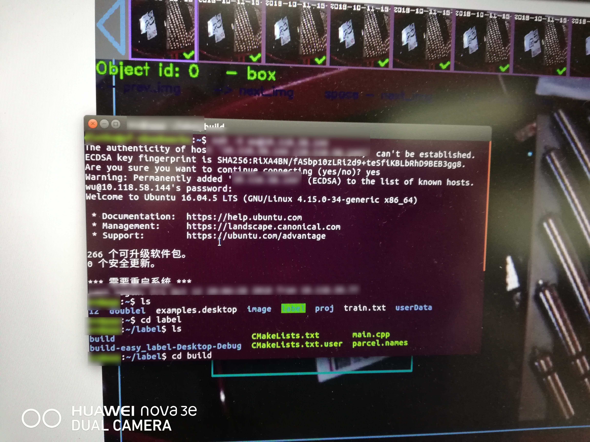

其实标题应该这样起：公司配备的HP暗影精灵笔记本(预装Win10，各种限制，比如禁用U盘、各类网盘及邮箱等)重装Ubuntu 一次让人无比蛋疼的经历，以下方法可能不具有普适性，如采用，先[备份](https://blog.csdn.net/sinat_27554409/article/details/78227496)。

**人物：**

    公司配备暗影精灵笔记本 本人

**起因：**

    部门临时任务，每个人分配800张图片进行标定，用到OpenCV，标定教程基于Ubuntu系统，但我所有设备都是Win10。为了不拖后腿，也为了以
    后工作需要，因此决定装Ubuntu

<!--more-->

**经过：**
 
> U盘安装ubuntu16.04

    安装次数： 一次 
    结果 算不上失败 但是系统安装好之后频繁卡机，令人无法忍受，放弃；

    11/9/2018 3:05:14 PM 更新
    卡机的原因应该是驱动问题，没有使用专用驱动，但是更新源后，在附加驱动里无法选择专有驱动，原因未知

> U盘安装ubuntu 18.04

    安装次数：好几次 
    结果 算不上成功 期间出现各种问题,

期间出现问题总结如下：
 
1. 系统安装完成后笔记本无法连接WIFI。各种百度，各种试错，最终在一次重启后不知道怎么就可以连了。可能适用的解决方案：①更换源为阿里云等，然后等待更新完成后，在附加驱动里选择专用驱动，确认重启(可能与在安装ubuntu时勾选安装第三方驱动有关，系统开始时使用了别的驱动)。此方法行不通的话，可尝试方法②。②更新内核，[内核网](http://kernel.ubuntu.com/~kernel-ppa/mainline/),拉到底部，找一个mainline build点进去，根据自己的系统架构(查看命令：`dpkg --print-architecture`)，选择相应框架下的deb文件，截止2018年11月9日，需下载的deb文件有四个，以暗影精灵笔记本为例，需下载的文件如下
下载完之后，`sudo dpkg -i *.deb`，然后重启，此时应该可以搜到WiFi。

2. 笔记本休眠后无法唤醒，只有重启。按照此[教程](https://blog.csdn.net/huludan/article/details/52725594)解决。

3. 就是由Ubuntu系统本身带来的各种不便和麻烦，比如 输入法，虽然有拼音输入，但是用着超级难受，于是找[教程](https://blog.csdn.net/fx_yzjy101/article/details/80243710)，安装搜狗；微信、网易云音乐、迅雷等常用软件，参照此[教程](https://blog.csdn.net/hanjushi2/article/details/82184397)解决。

    11/9/2018 3:51:01 PM 更新
    如果电脑配置不高，不建议按照上面教程进行安装(一个字 卡)，或者说根本不建议在Ubuntu下安装微信等软件，因为毕竟---Ubuntu是用来科(zhuang)研(bi)的！

4. Shadowsocks(梯子)，安装参照[教程](https://jerrysheh.github.io/post/879f3462.html)解决。其他小毛病有：笔记本安装完之后屏幕亮的闪瞎我的眼，于是上网百度调亮度方案，软件安装成功了，但是调整屏幕并没有反应。。。。就这样吧。桌面背景太难看，于是又找[教程](https://blog.csdn.net/lishanleilixin/article/details/80453565)。一套工作下来，整个人是懵B的！！！

**结果：**

经过了无数次sudo、重启、重装，最后系统总算安装成功了，哦，对了，说了这么多，差点忘了我们的出发点是安装OpenCV。安装OpenCV，参考[教程](https://blog.csdn.net/u013066730/article/details/79411767),又有一大堆的依赖包，于是一个一个安装，最后终于成功。你以为完了?结果是还有800张图片等着你去标定，于是马不停蹄，调动大脑和五官。经过几个小时的奋战，最后终于，终于结束了。

总体来说，这是一次令人蛋疼但又收获不少的经历。

一张工作开始的图片

一个关于数据标注的[视频](http://n.miaopai.com/media/JEimb5z~BNYp~ehoV589xhvXdihoGTyX)。