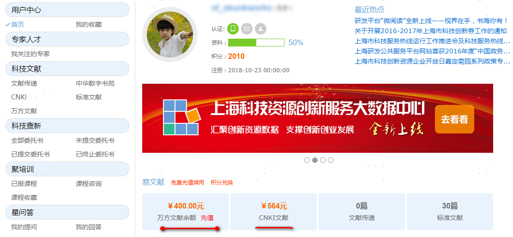
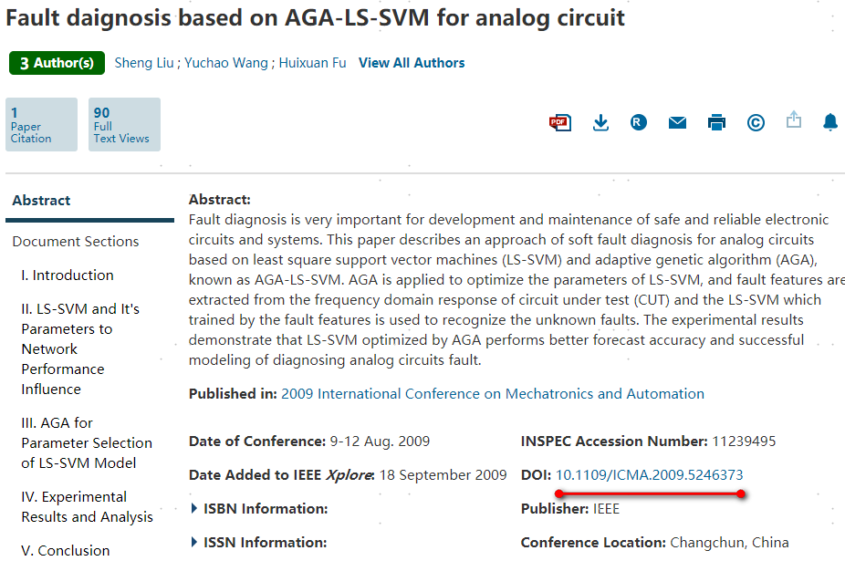
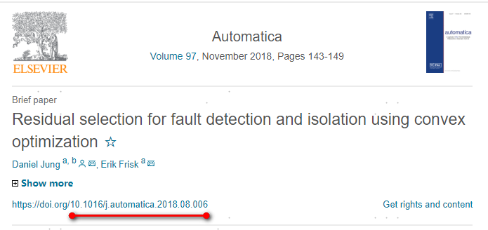

## 中文知网论文

#### 
(1)[iData镜像网站](https://www.cn-ki.net/)，注册后每天可下五篇, 换个邮箱注册又是五篇，不过有时候下载论文显示不正常，可换方法(2)，免费体验付费下载的快感；
<!--more-->
#### 
(2)[上海科技创新资源数据中心](http://member.sstir.cn)，注册-登录-点击用户名，可以看到系统向你的账号 知网充值600块， 万方400块，2000积分(可兑换知网200块)，如图

然后点击左侧 CNKI-访问CNKI，在页面输入要下载的论文(发表日期、作者、作者单位)， 检索文献，付费下载即可,如下图。

## 外文期刊论文

#### 
首先需要知道所找论文的DOI，IEEE的论文DOI位置为如图

Elsevier论文DOI位置为

找到之后，粘贴入[网址](http://sci-hub.se/), open-保存即可。

高阶指导可参考: [科研新手如何搜索查阅文献](http://wangwei.vip/note/howsci.html)
